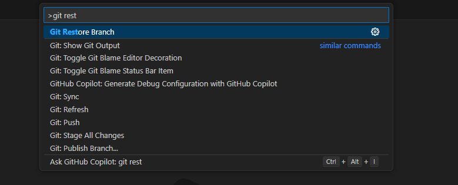
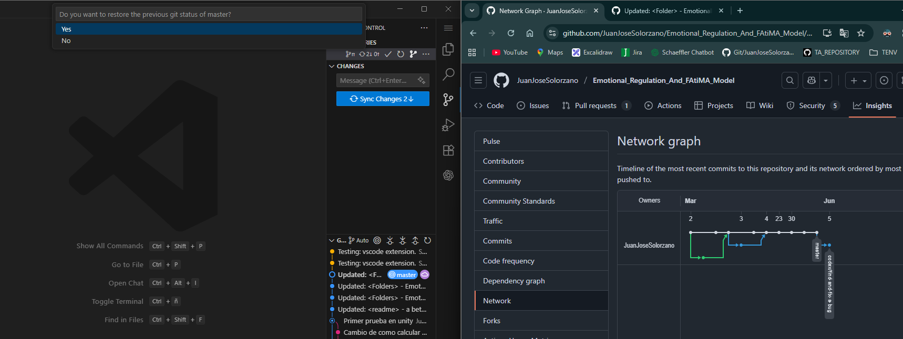
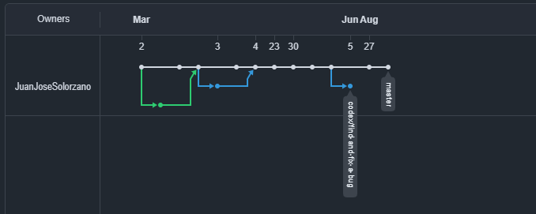

⚡ **Worried about breaking your GitHub branch?**  
Learning Git and afraid of messing up your repository? This extension helps you safely restore branches to a specific commit **without losing your work**.  

With the Command Palette action **`Git Restore Branch`**, you can:  

- Restore a remote branch to any commit.  
- Experiment without fear—since you can always roll back.  
- Learn Git commands in a practical and risk-free way.  

Perfect for both **beginners learning Git** and **developers who need a quick restore tool inside VS Code**.  

NOTE: You can open the Command Palette by pressing `Ctrl + Alt + P` 

👉 **Safely restore GitHub branches from VS Code.**  
Quickly roll back any branch to a specific commit with the `Git Restore Branch` command—without losing your work.  

---

## ✨ Features  
- Command **`Git Restore Branch`** to reset and force-push a branch to a specific commit.  
- Backup and restore your current Git state for extra safety.  

---

## ⚙️ Requirements  
- **VS Code 1.80** or later  
- A Git-enabled workspace  

---

## 🚀 Usage  

1. Open a workspace with Git initialized.  
2. Run **Git Restore Branch** from the Command Palette.  
3. Enter the target commit hash.  
4. Validate the branch status in GitHub if needed.  
5. Choose whether to restore your previous Git state when prompted.  

---

## 📸 Example  

1. Run the command:  
     

2. Enter the desired commit hash:  
     

3. Before answering the confirmation question, you can check your remote GitHub repository to ensure the branch looks correct:  
     

4. Select **Yes** if you want to restore your Git state to what it was before running the command. Otherwise, select **No**:  
     

5. After confirming, your remote GitHub repository will be restored to its previous state:  
     